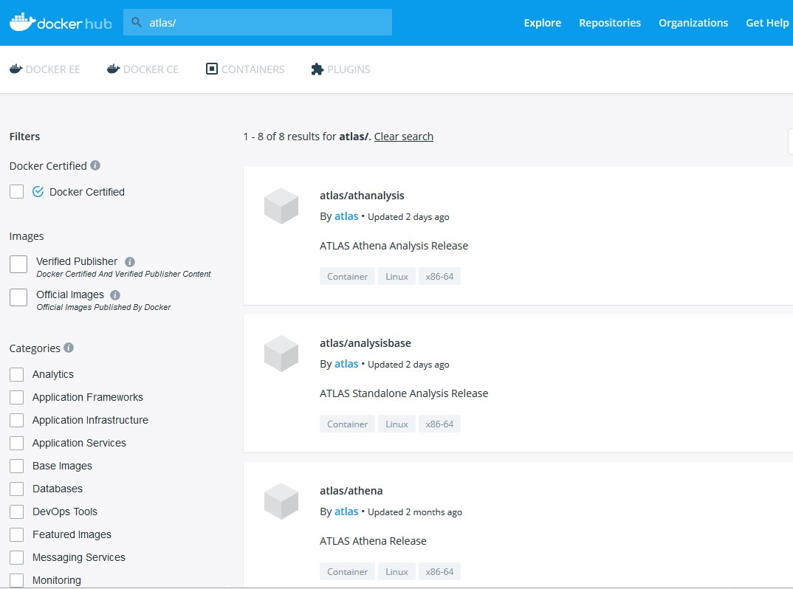

# Explore Container Images

## Containers on CVMFS

There are a few singularity containers accessible by keyword **slc5**, **slc6**,
**centos6** and **centos7** through command `setupATLAS -c`. There are many
other images available under **/cvmfs/unpacked.cern.ch/**. If this CVMFS path is
not visible, please add this mount point to the CVMFS client on your computer.

>     lxplus$ ls /cvmfs/unpacked.cern.ch/
>     gitlab-registry.cern.ch  logDir  registry.hub.docker.com
>
>     lxplus$ ls /cvmfs/unpacked.cern.ch/registry.hub.docker.com/
>     atlas        atlasml   cmssw      jodafons  lofaruser      siscia
>     atlasadc     atlrpv1l  danikam    kratsg    lukasheinrich  stfc
>     atlasamglab  clelange  engineren  library   pyhf           sweber613
>
>     lxplus$ ls /cvmfs/unpacked.cern.ch/registry.hub.docker.com/atlasml
>     atlasml-base:latest    ml-base:centos           ml-base:py-3.6.8
>     atlasml-base:py-3.6.8  ml-base:centos-py-3.6.8  ml-base:py-3.7.2
>     atlasml-base:py-3.7.2  ml-base:centos-py-3.7.2

The containers under `/cvmfs/unpacked.cern.ch/registry.hub.docker.com/atlasml/`
are for machine learning. For Atlas release containers, they are under
`/cvmfs/unpacked.cern.ch/registry.hub.docker.com/atlas/`

>     lxplus$ ls /cvmfs/unpacked.cern.ch/registry.hub.docker.com/atlas
>     analysisbase:21.2.10            athanalysis:21.2.102
>     analysisbase:21.2.100           athanalysis:21.2.10-20171115
>     [...]
>     analysisbase:21.2.16            athanalysis:21.2.19
>     analysisbase:21.2.16-20180129   athanalysis:21.2.19-20180221
>     analysisbase:21.2.17            athena:21.0.15
>     analysisbase:21.2.17-20180206   athena:21.0.15_100.0.2
>     analysisbase:21.2.18            athena:21.0.15_31.8.1
>     analysisbase:21.2.18-20180213   athena:21.0.15_DBRelease-100.0.2_Patched
>     analysisbase:21.2.19            athena:21.0.23
>     analysisbase:21.2.19-20180221   athena:21.0.23_DBRelease-200.0.1
>     analysisbase:21.2.60            athena:21.0.31
>     analysisbase:21.2.88            athena:21.0.31_100.0.2
>     athanalysis:21.2.10             athena:21.0.31_31.8.1
>     athanalysis:21.2.100            athena:22.0.5_2019-09-24T2128_100.0.2
>     athanalysis:21.2.100-20191127   athena:22.0.6_2019-10-04T2129
>     athanalysis:21.2.101            athena:22.0.9
>     athanalysis:21.2.101-20191208

Let us take an example of release AthAnalysis,2.2.115 under
`/cvmfs/unpacked.cern.ch/registry.hub.docker.com/atlas/`

>     lxplus$ singularity exec -c /cvmfs/unpacked.cern.ch/registry.hub.docker.com/atlas/athanalysis:21.2.115/release_setup.sh bash
>     singularity exec -c /cvmfs/unpacked.cern.ch/registry.hub.docker.com/atlas/athanalysis:21.2.115 bash
>     Singularity> ls /home/atlas
>     release_setup.sh
>     Singularity> source /home/atlas/release_setup.sh
>     Configured GCC from: /opt/lcg/gcc/8.3.0-cebb0/x86_64-centos7/bin/gcc
>     Taking LCG releases from: /opt/lcg
>     Taking Gaudi from: /usr/GAUDI/21.2.115/InstallArea/x86_64-centos7-gcc8-opt
>     Configured AthAnalysis from: /usr/AthAnalysis/21.2.115/InstallArea/x86_64-centos7-gcc8-opt
>     [bash][yesw AthAnalysis-21.2.115]:~ >

That is, start the wanted container, then source /home/atlas/release_setup.sh.

## Containers on Docker Hub

The Docker hub hosts the largest container images. You can input keyword to
[search on the hub](https://hub.docker.com/search/?q=rust&type=image). For
example, you can put a keyword "atlas/" under the search field as shown below:

- A screenshot of searching for "Atlas/" on the Docker Hub:
  

Click on the found container, it will provides the pull command instruction and
sometimes also a brief description.

## Containers on Singularity Hub and Library

There are many container images on the Singularity Hub and Library.

- Singularity Hub: <https://singularity-hub.org/>. Click "Collections" on the
  top menu to search by **Label**, **Tag** or **App** name.
- Singularity Library: <https://cloud.sylabs.io/library>. It is not supported in
  Singularity version 2. Put keyword in the search field on the very top to
  search for your wanted container.
