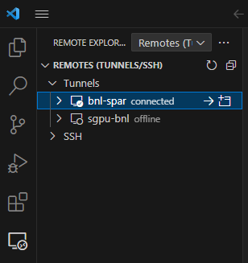

# Using VSCode

## Introduction

[Visual Studio Code](https://code.visualstudio.com/) is a lightweight but
powerful source code editor which runs on your desktop. It provides a rich code
editing experience with features like

- syntax highlighting
- auto-indentation
- intelliSense (context-aware suggestions as you type)
- linting for various programming languages
- powerful debugging
- Integrated Terminal

You can enhance its functionality by installing extensions from
[the Visual Studio Code Marketplace](https://marketplace.visualstudio.com/VSCode).

## Remote-Tunnels

The Visual Studio Code
[Remote - Tunnels](https://marketplace.visualstudio.com/items?itemName=ms-vscode.remote-server)
extension lets you connect to a remote machine, like a desktop PC or virtual
machine (VM), via a secure tunnel.

You can connect to that machine from a VS Code client anywhere, **without** the
requirement of **SSH**.

This can eliminate the need for source code to be on your VS Code client machine
since the **extension runs commands** and other extensions directly **on the
remote machine**.

VS Code can provide a **local-quality development experience** - including full
IntelliSense (completions), code navigation, and debugging - **regardless of
where your code is hosted**.

## Requirements to Run Remote-Tunnels

To run **Remote-Tunnels**, it requires:

- A GitHub account
- [VSCode CLI](https://code.visualstudio.com/docs/editor/command-line) on the
  remote machine

So you can edit in VSCode on local machine browser the files on the remote
machine.

But if you would like to use local VSCode client to edit the files on the remote
machine, you still need:

- VSCode client and extension _Remote-Tunnels_ on the local machine

## Setup Guide

### Step-1: Create a Secure Tunnel on the Remote Machine

You can grab the CLI through a
[standalone install](https://code.visualstudio.com/#alt-downloads). However, the
executable `code` has already been installed as
_/cvmfs/atlas.sdcc.bnl.gov/users/yesw/t3s/bin/code_.

Create a secure tunnel with the tunnel command:

```bash
code tunnel
```

It would print out something like:

```
* * Visual Studio Code Server * *
By using the software, you agree to
* the Visual Studio Code Server License Terms
  (https://aka.ms/vscode-server-license) and
* the Microsoft Privacy Statement
  (https://privacy.microsoft.com/en-US/privacystatement).
* To grant access to the server, please log into
  https://github.com/login/device and use code B45E-B1C0
```

On a browser, following the above instruction, visit
https://github.com/login/device, input the code. On the next web page, click on
the button of `Authorize Visual-Studio-Code`.

Afterward, the remote machine screen would prompt:

```
What would you like to call this machine?
```

Provide a name to the remote machine, for example, _BNL-ATTSUB_.

Then it would yield something like:

```
[2023-09-25 22:22:51] info Creating tunnel with the name: bnl-attsub

Open this link in your browser
https://vscode.dev/tunnel/bnl-attsub/home/tmp/yesw
```

Now you can explore the files on the remote machine, and use VSCode to edit
file:

- Either on a browser, open the above link:
  https://vscode.dev/tunnel/bnl-attsub/home/tmp/yesw
- Or in VSCode client, open **Remote Explorer**, click on **Remotes**, then
  **Tunnels**, choose the name **BNL-ATTSUB**.

In the VSCode client, you can see the name **BNL-ATTSUB** as shown in the
following screenshot:



Upon opening a folder/file, you just click on the button of
`Yes, I trusted the authors`.

---

## Remote SSH Extension

The Visual Studio Code
[Remote - SSH](https://code.visualstudio.com/docs/remote/ssh) extension lets you
use any remote machine with an SSH server as your development environment. This
is different from Remote Tunnels - it uses direct SSH connections to the remote
host.

The Remote - SSH extension:

- Runs commands and extensions directly on the remote machine
- Provides a local-quality development experience with full IntelliSense,
  debugging, and terminal access
- Requires SSH access to be configured (see our
  [SSH Access Guide](../computing/ssh_guide.md))

### SSH Keys and Passphrases

When using the Remote - SSH extension, SSH keys with passphrases can require
additional configuration. VS Code may have difficulty prompting for passphrases
during connection.

You have two options:

1. **Use SSH Agent** (recommended): Configure your SSH agent to cache your
   passphrase. See the
   [SSH Access Guide](../computing/ssh_guide.md#ssh-agent-setup) for setup
   instructions.

2. **Use keys without passphrases**: Generate a separate SSH key without a
   passphrase specifically for VS Code connections. Note that this is less
   secure.

For more details, see the
[VS Code SSH Git Authentication FAQ](https://code.visualstudio.com/docs/sourcecontrol/faq#_can-i-use-ssh-git-authentication-with-vs-code).

### Disconnecting from a Remote Host

To close the connection when you finish editing files on the remote host:

- Choose **File > Close Remote Connection** to disconnect from the host
- The default configuration does not include a keyboard shortcut for this
  command
- You can also simply exit VS Code to close the remote connection

---

## Connecting VSCode to JupyterLab Kernel

You can follow these steps to connect your Visual Studio Code to a JupyterLab
kernel that is running on the University of Chicago Analysis Facility (UC AF).
This allows you to work on your Jupyter notebooks using VS Code while utilizing
the computational resources of UC AF.

/// note

Make sure your JupyterLab instance is running and remains active while you are using VS Code to connect.

///

### Steps

1. **Access Your JupyterLab**:
    - Visit [UC AF JupyterLab](https://af.uchicago.edu/jupyterlab) to access
      your JupyterLab environment.
    - You'll need to log in with your credentials and create your Jupyter
      server.

2. **Get the JupyterLab URL**:
    - Right click on the link to your JupyterLab instance, then copy it. This
      link typically looks like
      `https://ivukotic-notebook-1.notebook.af.uchicago.edu/?token=...`.

3. **Configure VS Code**:
    - Open Visual Studio Code.
    - Install the **Python** and **Jupyter** extensions if you haven't already.

4. **Select Your Server and Kernel**:
    - Open the notebook file you wish to work on in VS Code.
    - Click on the kernel picker in the top right corner of the notebook editor
    - Click the kernel dropdown → click "Select Another Kernel..." → then
      "Existing Jupyter Server...".
    - Paste your server URI there.
    - Select the kernel you want to use from your JupyterLab.

5. **Using the Remote Kernel**:
    - Once the correct Kernel is selected, you can execute your notebook code
      within VS Code, utilizing the UC AF's computational resources.
    - If you encounter issues, ensure that VS Code is allowed through your
      firewall if applicable, and your network allows communicating with the UC
      AF nodes.


## Important: Background Jobs Continue Running

/// danger | Closing VS Code Does NOT Terminate Jobs

**Critical**: Closing VS Code or disconnecting from an SSH session does NOT
terminate jobs running on the remote machine. This includes:

- Jupyter notebook kernels
- Running scripts or processes
- Background jobs
- Interactive programs

**You must explicitly terminate processes** using commands like `kill`, `pkill`,
or by using proper termination methods within your programs.

///

### Common Misconceptions

Many users mistakenly believe that closing VS Code or their SSH session will
clean up running jobs. **This is not true.** The SSH session is just a
connection to the server - closing it does not affect processes running on the
server.

**Important keyboard shortcuts**:

- <kbd>Control</kbd>+<kbd>C</kbd>: **Terminates** the current process (sends
  SIGINT)
- <kbd>Control</kbd>+<kbd>Z</kbd>: **Suspends** the current process (sends
  SIGTSTP) - does NOT terminate it

If you use <kbd>Control</kbd>+<kbd>Z</kbd>, the process is only suspended and
will continue consuming resources. You must use `kill` or `pkill` to actually
terminate suspended processes.

For more information on process control and session management, see the
[FAQs and Tips](../faqs_tips.md) page.
