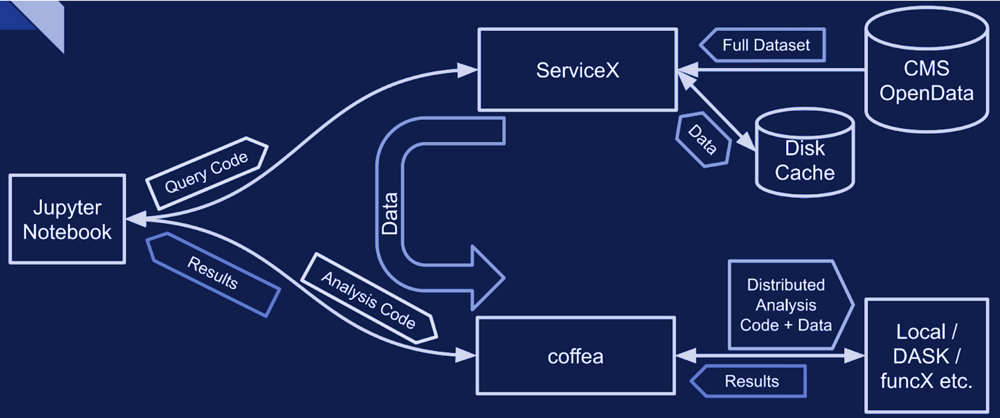
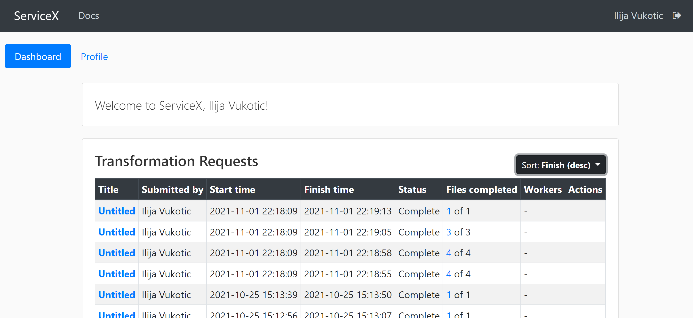
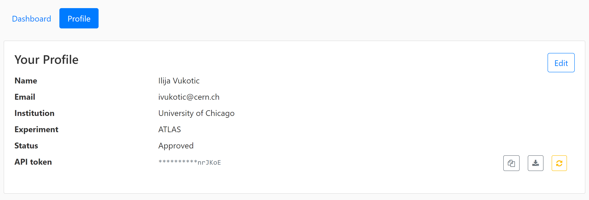

# ServiceX

When dealing with very large datasets it is often better to do initial data
filtering, augmentation using
[ServiceX](https://iris-hep.org/projects/servicex).

ServiceX transformation produces output as an Awkward Array. The array can then
be used in a regular Coffea processing.

Here a scheme explaining the workflow:

There are two different, UC AF deployed ServiceX instances. The only difference
between them is the type of input data they are capable of processing.
[Uproot](https://uproot-atlas.servicex.af.uchicago.edu/) processes any kind of
"flat" ROOT files, while [xAOD](https://xaod.servicex.af.uchicago.edu/)
processes only Rucio registered xAOD files.

To use them one has to register and get approved. Sign in will lead you to a
Globus registration page, where you may choose to use account connected to your
institution:

Once approved, you will be able to see status of your requests in the dashboard:

For your code to be able to authenticate your requests, you need to download a
servicex.yaml file, that should be placed in your working directory. The file is
downloaded from your profile page:

From the IRIS-HEP analysis grand challenge, there was an
[example analysis using ServiceX and Coffea](https://github.com/iris-hep/analysis-grand-challenge/blob/main/workshops/agctools2021/HZZ_analysis_pipeline/HZZ_analysis_pipeline.ipynb).

## More Examples

- [Columnar data analysis with DAOD_PHYSLITE](https://github.com/nikoladze/agc-tools-workshop-2021-physlite)
- [ServiceX analysis on ROOT files, with Coffea, and TRExFitter](https://github.com/kyungeonchoi/ServiceX-at-IRIS-HEP-ACG-workshop-2021)
