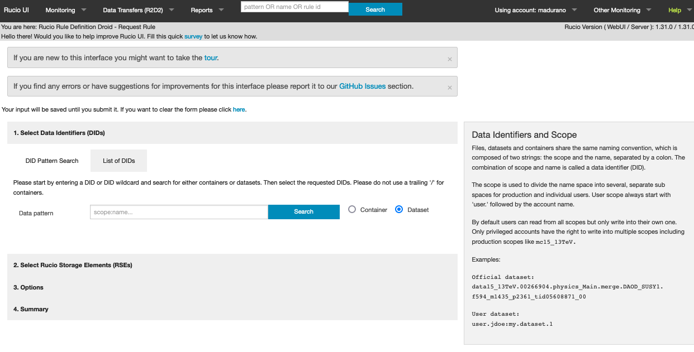

# Data Storage at UChicago

## Storage Limits

<table>
<thead>
<tr>
<th>Filesystem</th>
<th>Quota</th>
<th>Path</th>
<th>Backed up?</th>
<th>Notes</th>
</tr>
</thead>
<tbody>
<tr>
<td>$home</td>
<td>100GB</td>
<td>/home/$user </td>
<td>Yes</td>
<td>Solid-state filesystem, shared to all worker nodes</td>
</tr>
<tr>
<td>$data</td>
<td> 5 TB </td>
<td>/data/$user  </td>
<td>No</td>
<td>CephFS filesystem, shared to all worker nodes</td>
</tr>
<tr>
<td>$scratch</td>
<td>n/a  </td>
<td>/scratch</td>
<td>No </td>
<td>Ephemeral storage for workloads, local to worker nodes</td>
<td>
</tr>
</tbody>
</table>

## Filesystems

The UChicago analysis facility has three filesystems with a clearly defined
role. Please be aware of each of these roles when running workloads.

<table>
<thead>
<tr>
<th>Filesystem</th>
<th>Function</th>
</tr>
</thead>
<tbody>
<tr>
<td>$home</td>
<td>
Your home area is intended to store small files like analysis code, scripts, small samples.
 Please store your big data files on the $data filesystem. </td>

</tr>
<tr>
<td>$data</td>
<td>
This directory is the dedicated shared filesystem to storage data, i.e. the big files,  that is, for example your data samples.</td>

</tr>
<tr>
<td>$scratch</td>
<td>

This filesystem is an ephemeral storage for workloads and local to worker nodes.
  All jobs start in this directory on the worker nodes by default.
 Consequently, Output data will need to be staged to the shared filesystem or it will be lost!.
  In the next sections you can find examples and more details about this directory and its use.

</tbody>
</table>

## LOCALGROUPDISK

If you need more space to storage data, need to share it with your teamwork or
colleagues who are not necessarily using the UChicago Analysis Facility you can
use LOCALGROUPDISK which is a disk resource for all US-ATLAS members. Check the
Rucio documentation at
[RSE Rucio manage quota](https://rucio-ui.cern.ch/r2d2/manage_quota), type
`MWT2_UC_LOCALGROUPDISK` in the text box:

and click the `select` button. If you search your lxplus username you'll see
that you have a default quota of 15TB. For additional space if need beyond 15TB
here is the
[Request form](https://atlas-lgdm.cern.ch/LocalDisk_Usage/USER/RequestFormUsage/).
Remember that you need US-ATLAS VO for the grid certificate.

If you are an ATLAS member but can't find your name go to
[VOMS page](https://lcg-voms2.cern.ch:8443/voms/atlas/user/home.action) and
select /atlas/usatlas in the "groups roles" box:

### Transfer datasets to LOCALGROUPDISK

To transfer datasets to LOCALGROUPDISK, check the following 3 options:

- Using **r2d2**, make your request in the Rucio page
  [rucio r2d2 request](https://rucio-ui.cern.ch/r2d2/request):
  
- Adding “-destSE” to your PANDA job.
- Via Rucio on the command line

### How to access datasets

To access datasets, you can choose one of the following 3 options.

- In grid-based analyses
- Through XRootD from shared T3’s, check the
  [Data Sharing section](http://127.0.0.1:8000/doma/DataSharing/).
- Download locally, remember to use the proper filesystem, eg: to storage large
  data samples files use $data.
