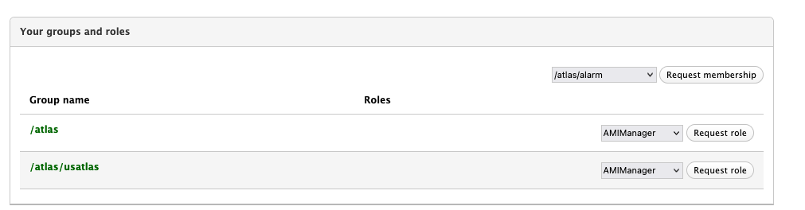

# Data Storage at UChicago

## Table of contents
+ [Storage Limits](#storage-limits)
+ [FileSystems](#filesystems)
+ [LOCALGROUPDISK](#localgroupdisk)
<!--+ [-](#-)-->
## Storage Limits
[]:#(table2  with filesystems differences)
<table>
<thead>
<tr>
<th>Filesystem</th>
<th>Quota</th>
<th>Path</th>
<th>Backed up?</th>
<th>Notes</th>
</tr>
</thead>
<tbody>
<tr>
<td>$home</td>
<td>100GB</td>
<td>/home/$user </td>
<td>Yes</td>
<td>Solid-state filesystem, shared to all worker nodes</td>
</tr>
<tr>
<td>$data</td>
<td> 5 TB </td>
<td>/data/$user  </td>
<td>No</td>
<td>CephFS filesystem, shared to all worker nodes</td>
</tr>
<tr>
<td>$scratch</td>
<td>n/a  </td>
<td>/scratch</td>
<td>No </td>
<td>Ephemeral storage for workloads, local to worker nodes</td>
<td>
</tr>
</tbody>
</table>

## Filesystems 

The UChicago analysis facility has three filesystems with a clearly defined role. Please be aware of each of these roles when running workloads. 
[]:#(table with filesystems functions)
<table>
<thead>
<tr>
<th>Filesystem</th>
<th>Function</th>
</tr>
</thead>
<tbody>
<tr>
<td>$home</td>
<td>
Your home area is intended to store small files like analysis code, scripts, small samples.
 Please store your big data files on the $data filesystem. </td>

</tr>
<tr>
<td>$data</td>
<td>
This directory is the dedicated shared filesystem to storage data, i.e. the big files,  that is, for example your data samples.</td>

</tr>
<tr>
<td>$scratch</td>
<td>

This filesystem is an ephemeral storage for workloads and local to worker nodes.
  All jobs start in this directory on the worker nodes by default. 
 Consequently, Output data will need to be staged to the shared filesystem or it will be lost!.
  In the next sections you can find examples and more details about this directory and its use.

</tbody>
</table>

## LOCALGROUPDISK
If you need more space to storage data, need to share it with your teamwork or colleagues who are not necessarily using the UChicago Analysis Facility you can use LOCALGROUPDISK which is a disk resource for all US-ATLAS members.
Check the Rucio documentation at [RSE Rucio manage quota](https://rucio-ui.cern.ch/r2d2/manage_quota), type `MWT2_UC_LOCALGROUPDISK` in the text box:

and click the `select` button. If you search your lxplus username you'll see that you have a default quota of 15TB. For additional space if need beyond 30TB here is the [Request form]( https://atlas-lgdm.cern.ch/LocalDisk_Usage/USER/RequestFormUsage/).
Remember that you need US-ATLAS VO for the grid certificate. If you are an ATLAS member but can't find your name go to [VOMS page](https://lcg-voms2.cern.ch:8443/voms/atlas/user/home.action) and select /atlas/usatlas in the groups roles box.

 ### Transfer datasets to LOCALGROUP DISK

To transfer datasets to LOCALGROUPDISK, check the following 3 options: 

- Using **r2d2**, make your request in the Rucio page [rucio r2d2 request](https://rucio-ui.cern.ch/r2d2/request).
- Adding “-destSE” to your PANDA job.
- Via Rucio on the command line

 ### How to access datasets

To access datasets, you can choose one of the following 3 options. 

- In grid-based analyses
- Through XRootD from shared T3’s, check the [Data Sharing section](http://127.0.0.1:8000/doma/DataSharing/).
- Download locally, remember to use the proper filesystem, eg: to storage large data samples files use $data. 

