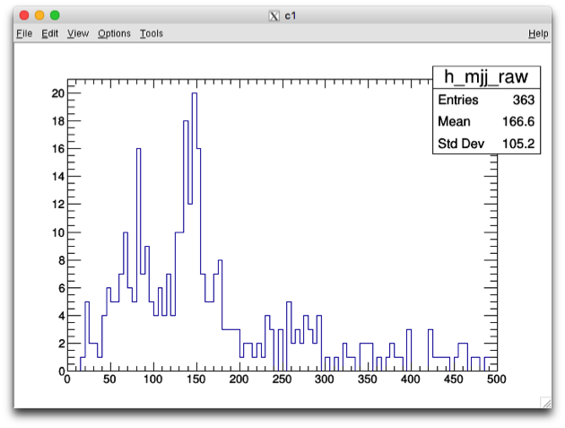

# Running the tutorial example at BNL Tier3

## Table of Contents

- [Login to BNL machines](#login-to-bnl-machines)
- [Location of this analysis example package at BNL](#location-of-this-analysis-example-package-at-bnl)
- [Env Setup and Package Building](#env-setup-and-package-building)
    - [Setup of the Release Env](#setup-of-the-release-env)
    - [Package Building](#package-building)
- [Dataset Preparation](#dataset-preparation)
- [Interactive Job Running at BNL](#interactive-job-running-at-bnl)
- [Condor Batch Job Running at BNL](#condor-batch-job-running-at-bnl)
- [Using Xcache at BNL](#using-xcache-at-bnl)
    - [Using Xcache (gLFN) at BNL](#using-xcache-glfn-at-bnl)

---

## Login to BNL machines

First you need ssh to spar machines at BNL:

```shell
$ ssh -Y atlasgw
$ rterm -i
```

---

## Location of this analysis example package at BNL

You can pull the analysis package under the same github repo directory or copy
from the directory at BNL:

```
/atlasgpfs01/usatlas/data/yesw2000/T3-Example-BNL/
|-- 00-Readme.txt
|-- Condor-Job
|   `-- test-condor.job
`-- src
    |-- CMakeLists.txt
    `-- Exam_JetsPlot.cxx
```

where you can find:

- the text instruction file **00-Readme.txt**, from which you can copy/paste the
  commands used in this tutorial.
- The condor job description file **test-condor.job**
- And the source code of this analysis package under subdir **src/**

---

## Env Setup and Package Building

### Setup of the Release Env

First set up the release env by:

```
setupATLAS
asetup AnalysisBase,21.2.81
```

Next time you log in, you can simply run **asetup** under the same dir.

### Package Building

To build the single package, just run under that dir:

```shell
cmake src  # generate Makefile
make       # compile & create executable file
```

After the package is built, you will see

> $ ls -F 00-Readme.txt Makefile CMakeCache.txt bin/ CMakeFiles/
> cmake_install.cmake Condor-Job/ src/

and

> $ ls bin/ Exam_JetsPlot

To get the usage of the single analysis program, run

```
bin/Exam_JetsPlot -h
```

You will get

<blockquote><pre>Usage: bin/Exam_JetsPlot <option(s)> inputRootFile

        A simple example to make a few jet plots

Options: -h,--help Show this help message

</pre></blockquote>

---

## Dataset Preparation

To run the analysis, we need an input dataset.

```
dset=data18_13TeV.00348885.physics_Main.deriv.DAOD_EXOT12.f937_m1972_p3553_tid14278917_00
```

To list the files in the dataset, set up rucio env and VO-atlas proxy first,
then run script pnfs_ls.py to list file path.

```shell
lsetup rucio
voms-proxy-init -voms atlas
pnfs_ls.py $dset -o dset-inside.clist                       # pls run "pns_ls.py -h" for usage (next section)
pnfs_ls.py $dset --useXRootdOutside -o dset-outside.clist   # for outside access
```

To get the script pnfs_ls.py usage, just run **pnfs_ls.py -h**.

Please click the following arrow to see the full usage.

<details>

<summary>pnfs_ls.py -h</summary>
<blockquote><pre>
Usage:
     pnfs_ls.py [options] dsetListFile
  or
     pnfs_ls.py [options] dsetNamePattern[,dsetNamePattern2[,more namePatterns]]
  or
     pnfs_ls.py -o clistFilename /pnfs/FilePathPattern [morePaths]
  or
     pnfs_ls.py -p -o clistFilename [pnfsFilePath | pnfsDirPath] [morePaths]

This script generates pfn (physical file name), pnfs-path, or xrootd-path of
files on BNL dcache for given datasets or files on PNFS, where wildcard and
symlink are supported in pnfsFilePath and pnfsDirPath

Options: -h, --help show this help message and exit -v Verbose -V, --version
print my version -p, --privateFiles List private non-dataset files on dCache -i,
--incomplete Use incomplete sites if complete not available -u, --usersDCache
Use datasets under users private dCache -l, --listOnly list only matched
datasets under users dCache, no pfn output -o OUTPFNFILE,
--outPfnFile=OUTPFNFILE write pfn list into a file instead of printing to the
screen -d OUTPFNDIR, --dirForPfn=OUTPFNDIR write pfn list into a directory with
a file per dataset -N, --usePNFS using pNFS access, default is xrootd within BNL
--useXRootdOutside using xroot from outside BNL: access, default is xrootd
within BNL -L LOCALBNLSITE, --localBNLSite=LOCALBNLSITE specify a BNL site,
overriding the one chosen by the script

</pre></blockquote>
</details>

---

Let us look into the generated file dset-inside.clist
`$ head -5 dset-inside.clist`

<blockquote><pre>
# clist file for access within BNL
#site= BNL-OSG2_LOCALGROUPDISK ; dset= data18_13TeV.00348885.physics_Main.deriv.DAOD_EXOT12.f937_m1972_p3553_tid14278917_00
root://dcgftp.usatlas.bnl.gov:1096//pnfs/usatlas.bnl.gov/LOCALGROUPDISK/rucio/data18_13TeV/da/ea/DAOD_EXOT12.14278917._000001.pool.root.1
root://dcgftp.usatlas.bnl.gov:1096//pnfs/usatlas.bnl.gov/LOCALGROUPDISK/rucio/data18_13TeV/32/82/DAOD_EXOT12.14278917._000002.pool.root.1
root://dcgftp.usatlas.bnl.gov:1096//pnfs/usatlas.bnl.gov/LOCALGROUPDISK/rucio/data18_13TeV/86/76/DAOD_EXOT12.14278917._000003.pool.root.1
</pre></blockquote>

---

## Interactive Job Running at BNL

Now we can run the job interactively

```shell
mkdir Interactive-Job
cd Interactive-Job
```

Take one input file in "dset-inside.clist"

```shell
inputFile=root://dcgftp.usatlas.bnl.gov:1096/pnfs/usatlas.bnl.gov/LOCALGROUPDISK/rucio/data18_13TeV/da/ea/DAOD_EXOT12.14278917._000001.pool.root.1
../bin/Exam_JetsPlot $inputFile > myjob.log 2>&1
```

It will write out an output file _myOutputFile.root_ You can take a look of the
log file _myjob.log_, containing info of input file and event processing
progress.

Let us look into the output root file **myOutputFile.root**

<blockquote><pre>
$ root -l  myOutputFile.root
root [1] .ls
TFile**         myOutputFile.root
 TFile*         myOutputFile.root
  KEY: TH1D     h_njets_raw;1
  KEY: TH1D     h_mjj_raw;1
root [2] h_mjj_raw->Draw();
</pre></blockquote>
which will yield the plot



---

## Condor Batch Job Running at BNL

At BNL, the batch queue uses condor system. The working directory of Condor
batch jobs is different from current working directory, and you need specify
**"GetEnv = True"** to pass the current env variables.

```shell
cd Condor-Job
ls -l $X509_USER_PROXY    # under local disk /tmp/, we need copy/delegate it to the batch machines
```

Let us take a look of job description file **test-condor.job**

Please click the following filename to see its content

<details>

<summary>test-condor.job</summary>
<blockquote><pre>
universe=vanilla

output=myjob.out error=myjob.err log=myjob-running.log

executable=../bin/Exam_JetsPlot inputFile =
root://dcgftp.usatlas.bnl.gov:1096/pnfs/usatlas.bnl.gov/LOCALGROUPDISK/rucio/data18_13TeV/03/7e/DAOD_EXOT12.14278917.\_000011.pool.root.1
arguments=$(inputFile)

GetEnv = True # pass the env x509userproxy = $ENV(X509_USER_PROXY) # copy the
grid proxy

\# this is what turns this feature on should_transfer_files=yes
WhenToTransferOutput=on_exit

queue

</pre></blockquote>
</details>

Run the following command to submit the condor job

```shell
$ condor_submit  test-condor.job
```

Then you can run **condor_q** to check your job status.

<blockquote><pre>
$ condor_q
-- Schedd: spar0103.usatlas.bnl.gov : <130.199.48.19:9618?... @ 08/02/19 13:12:27
 ID       OWNER            SUBMITTED     RUN_TIME ST PRI SIZE CMD
35106.0   yesw2000        8/2  13:12   0+00:00:00 I  0    0.3 Exam_JetsPlot

Total for query: 1 jobs; 0 completed, 0 removed, 1 idle, 0 running, 0 held, 0
suspended Total for yesw2000: 1 jobs; 0 completed, 0 removed, 1 idle, 0 running,
0 held, 0 suspended Total for all users: 2 jobs; 0 completed, 0 removed, 1 idle,
1 running, 0 held, 0 suspended

</pre></blockquote>

After the job is done, we will see

<blockquote><pre>
$ ls -l
total 44
-rw-r--r-- 1 yesw2000 usatlas  4367 Aug  2 13:15 myOutputFile.root
-rw-r--r-- 1 yesw2000 usatlas   967 Aug  2 13:15 myjob-running.log
-rw-r--r-- 1 yesw2000 usatlas   335 Aug  2 13:15 myjob.err
-rw-r--r-- 1 yesw2000 usatlas 20934 Aug  2 13:15 myjob.out
-rw-r--r-- 1 yesw2000 usatlas   434 Aug  2 12:18 test-condor.job
</pre></blockquote>

There are 4 files created by the batch job:

- _myjob-running.log_, is the condor log file, created right at the job
  submission and being updated until the job completion.
- Other 3 files, _myjob.out_, _myjob.err_ and _myOutputFile.root_, created on
  the batch machine, transferred back after the job completion.

Similarly, you can also look into the output file _myOutputFile.root_ and make
the plot.


---

## Using Xcache at BNL

Xcache enables to access data remotely and also to cache them locally for faster
access in future.

The Xcache server at BNL is **root://xrootd03.usatlas.bnl.gov:1094/**.

Let us take the input file used in the SLAC example. At SLAC, the inputFile name
for outside access (check the file _dset-outside.txt_ at SLAC) is

```
inputFile=root://griddev03.slac.stanford.edu:2094//xrootd/atlas/atlaslocalgroupdisk/rucio/data16_13TeV/f9/bd/DAOD_SUSY15.11525262._000003.pool.root.1
```

For Xcache, we need add the Xcache server prefix with two slash characters, that
is,

```
inputFile=root://xrootd03.usatlas.bnl.gov:1094//root://griddev03.slac.stanford.edu:2094//xrootd/atlas/atlaslocalgroupdisk/rucio/data16_13TeV/f9/bd/DAOD_SUSY15.11525262._000003.pool.root.1
cd T3-Example-BNL/Interactive-Job
../bin/Exam_JetsPlot $inputFile > myjob.log 2>&1
```

### Using Xcache (gLFN) at BNL

Xcache at BNL also supports gLFN (global Logical File Name) access, without the
need of knowing the exact path of a given filename.

Let us take the same dataset used in the SLAC example.

Please click the following command (where **dset** is defined previously) to see
the output

<details>

<summary>rucio list-dataset-replicas $dset</summary>
<blockquote><pre>
DATASET: data16_13TeV:data16_13TeV.00311481.physics_Main.merge.DAOD_SUSY15.f758_m1616_r8669_p3185_tid11525262_00
+-------------------------------+---------+---------+
| RSE                           |   FOUND |   TOTAL |
|-------------------------------+---------+---------|
| MWT2_UC_LOCALGROUPDISK        |      39 |      39 |
| OU_OSCER_ATLAS_LOCALGROUPDISK |      39 |      39 |
| AGLT2_LOCALGROUPDISK          |      39 |      39 |
| NERSC_LOCALGROUPDISK          |      39 |      39 |
| BNL-OSG2_LOCALGROUPDISK       |      39 |      39 |
| CERN-PROD_DATADISK            |      39 |      39 |
| NET2_LOCALGROUPDISK           |      39 |      39 |
| SLACXRD_LOCALGROUPDISK        |      39 |      39 |
| SWT2_CPB_LOCALGROUPDISK       |      39 |      39 |
| NET2_DATADISK                 |      39 |      39 |
+-------------------------------+---------+---------+
</pre></blockquote>
</details>

Let us to list the filenames in the dataset

<blockquote><pre>
$ rucio list-content $dset
+-------------------------------------------------------+--------------+
| SCOPE:NAME                                            | [DID TYPE]   |
|-------------------------------------------------------+--------------|
| data16_13TeV:DAOD_SUSY15.11525262._000003.pool.root.1 | FILE         |
| data16_13TeV:DAOD_SUSY15.11525262._000006.pool.root.1 | FILE         |
...
</pre></blockquote>

Let us take the second one file.

```
inputFile=root://xrootd03.usatlas.bnl.gov:1094//atlas/rucio/data16_13TeV:DAOD_SUSY15.11525262._000003.pool.root.1
../bin/Exam_JetsPlot $inputFile > myjob.log 2>&1
```

Enclosed is a screenshot of the condor running jobs.

<blockquote><pre>
$ condor_q
-- Schedd: spar0103.usatlas.bnl.gov : <130.199.48.19:9618?... @ 08/02/19 13:12:36
 ID       OWNER            SUBMITTED     RUN_TIME ST PRI SIZE CMD
35106.0   yesw2000        8/2  13:12   0+00:00:01 R  0    0.3 Exam_JetsPlot

Total for query: 1 jobs; 0 completed, 0 removed, 0 idle, 1 running, 0 held, 0
suspended Total for yesw2000: 1 jobs; 0 completed, 0 removed, 0 idle, 1 running,
0 held, 0 suspended Total for all users: 2 jobs; 0 completed, 0 removed, 0 idle,
2 running, 0 held, 0 suspended

</pre></blockquote>
